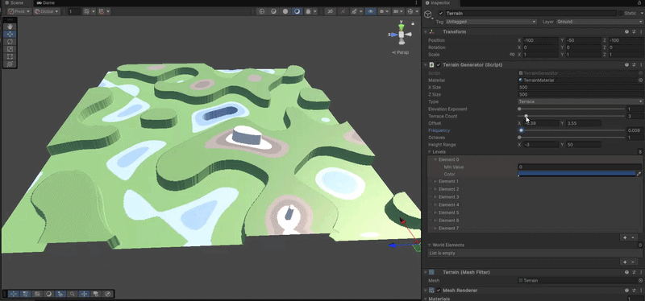
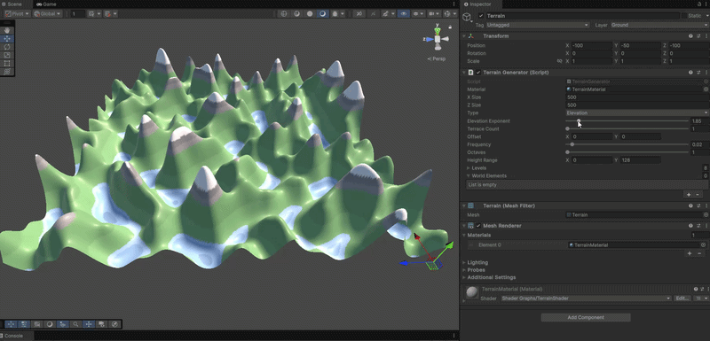
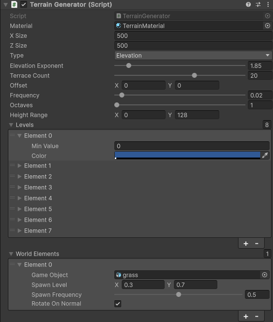
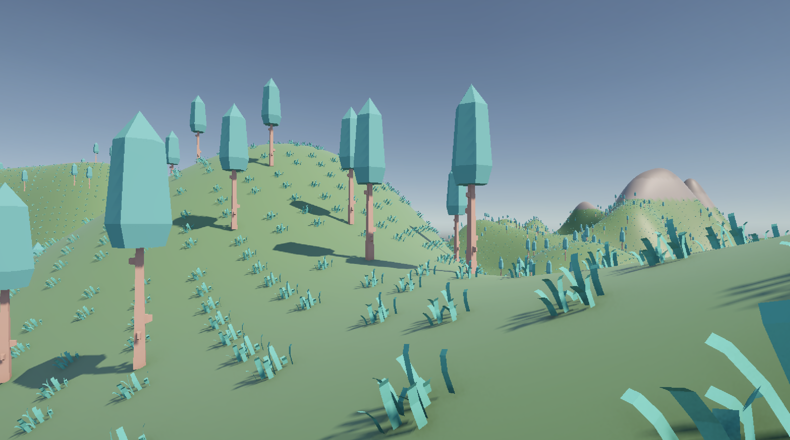

# Procedural Terrain Generator
A Unity-based procedural terrain generation system that provides customizable terrain features. 





## Features

- Procedurally generated mesh terrain, fully configurable from the Unity Inspector
- Two terrain shaping modes: smooth elevation (hills/valleys) or stepped terraces
- Multi-octave noise for added detail and complexity
- Height-based coloring via configurable terrain levels
- Automatic spawning of prefabs (trees, rocks, etc.) within chosen height ranges
- Live regeneration in the Editor as parameters change

## Getting started

**Requirements:** Unity 6, URP

1. Clone the repository
```
git clone https://github.com/lavinia-lehaci/Procedural-Terrain-Generator.git
```
2. Open the project in Unity and load the sample scene, then press Play to see it in action.

3. To use it in your own project: create an empty GameObject, attach the `TerrainGenerator` script to it, and configure it from the Inspector.  
> Note: the script doesn't add a `MeshCollider` automatically, add one manually if you need collision.

## Configuration
<table>
<tr>
<td width="50%">


</td>
<td width="50%">

- ``Material``- Material applied to the generated mesh 
- ``xSize``, ``zSize`` - Mesh resolution (vertices − 1) on the X/Z axes
- ``Type`` 
    - ``Elevation`` - Generates hills/valleys, with an ``Elevation Exponent`` controlling the steepness
    - ``Terrace`` - Creates step-like terrain, with a ``Terrace Count`` as the number of steps or levels
- ``Offset`` - Displacement or shift applied to the Perlin Noise values
- ``Frequency`` - Factor that controls the scale of terrain features (higher = more detail, lower = smoother)
- ``Octaves`` - Number of combined noise layers for added complexity
- ``Height Range`` - Min/max height the generated terrain is mapped to
- ``Levels`` - Height bands, each with a minimum height and a color
- ``World Elements`` - Prefabs to scatter across the terrain, with a height range, spawn frequency, and optional alignment to the surface normal

</td>

</tr>
</table>

The mesh regenerates automatically when Inspector parameters change, or on demand via `UpdateTerrain()`.

## Known limitations

- World element spawning instantiates and destroys GameObjects directly rather than using an object pool, which makes it noticeably heavier on performance when regenerating terrain with many elements. Object pooling would be the natural next improvement.
- There's currently no way to export generated terrain data for reuse. An export button (saving vertex/height data, or the full mesh, to a file) would let a specific generated terrain be reloaded later.

##  How it works

The core logic lives entirely in the ``TerrainGenerator`` script.

On initialization, the script creates and configures `Mesh`, `MeshFilter`, and `MeshRenderer` components. The mesh's index format is set to `UInt32` (instead of the default `UInt16`) to support larger vertex counts than the default format allows.

Vertices and triangles are built following the [procedural grid approach from Catlike Coding](https://catlikecoding.com/unity/tutorials/procedural-grid/). Each vertex's height comes from Unity's `Mathf.PerlinNoise()`, sampled from the vertex's X and Z positions. An offset shifts the noise pattern across the terrain, and the result is scaled by the frequency parameter to control terrain detail and elevation. Octaves are additional layers of noise that increase in frequency with each level. With each successive octave, the terrain becomes more complex and varied.

Following the approach outlined in [Making maps with noise functions](https://www.redblobgames.com/maps/terrain-from-noise/), the script allows for two terrain types: elevation and terrace. The elevation type allows for valleys and hills, while the terrace type creates step-like terrain.
 
Terrain levels and world elements are defined as custom structs. Levels pair a minimum height with a color, letting different elevation bands be visually distinguished. World elements are prefabs spawned within a given height range at a configurable frequency, optionally aligned to the mesh's surface normal for a more natural look.

The included [Starter Assets](https://assetstore.unity.com/packages/essentials/starter-assets-thirdperson-updates-in-new-charactercontroller-pa-196526) package allows walking across the generated terrain in the sample scene.

<figure>
  
</figure>

## References
- Tutorials
  - [Procedural Grid – Catlike Coding](https://catlikecoding.com/unity/tutorials/procedural-grid/)
  - [Making maps with noise functions – Red Blob Games](https://www.redblobgames.com/maps/terrain-from-noise/)
- Assets
  - [Nature Kit – Kenney](https://kenney.nl/assets/nature-kit)
  - [Starter Assets – ThirdPerson](https://assetstore.unity.com/packages/essentials/starter-assets-thirdperson-updates-in-new-charactercontroller-pa-196526)

## License
This project is licensed under the MIT License - see the [LICENSE](LICENSE) file for details.
