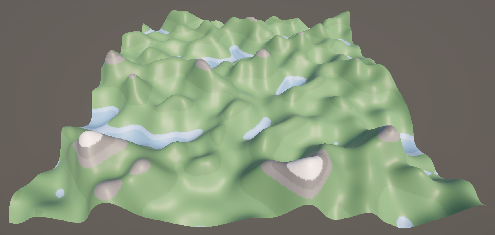
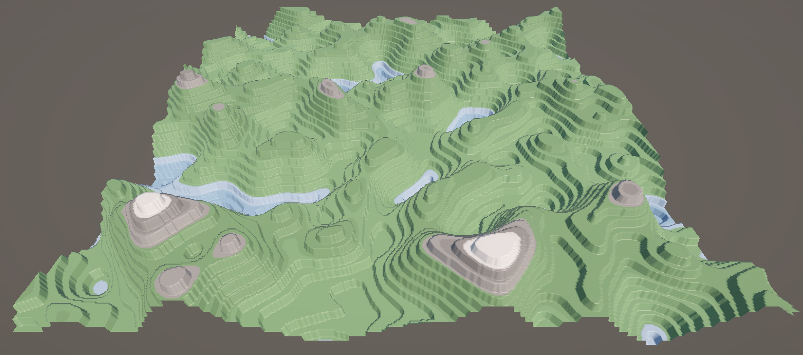

# Procedural Terrain Generator
A Unity-based procedural terrain generation system that provides customizable terrain features. 

##  Workflow

The entire logic lays in the ``TerrainGenerator`` script.

During the initialization of the script, a ``Mesh``, ``MeshFilter``, and ``MeshRenderer`` are created and set up. To support larger mesh sizes, the mesh's index format is changed to ``UInt32`` as the default ``UInt16`` limits the number of vertices.

The mesh's vertices and triangles are initialized and computed according to the [procedural grid](https://catlikecoding.com/unity/tutorials/procedural-grid/) tutorial from *Catlike Coding*. Each vertex's height is influenced by a combination of Perlin Noise and several parameters, including frequency, offset, and octaves. The ``Mathf.PerlinNoise()`` function is used to generate noise based on the X and Z positions of each vertex, returning a value between 0 and 1. To introduce variation across the terrain, an offset is applied to the X and Z coordinates, shifting the noise pattern on these axes. The result is then scaled vertically by multiplying with the frequency, allowing the terrain to be adjusted in terms of detail and elevation. Octaves are additional layers of noise that increase in frequency with each level. With each successive octave, the terrain becomes more complex and varied.

Following the approach outlined in [Making maps with noise functions](https://www.redblobgames.com/maps/terrain-from-noise/), the script allows for two terrain types: elevation and terrace. The elevation type allows for valleys and hills, while the terrace type creates step-like terrain.

<p align="center">
  
  <figcaption align="center">Elevation type</figcaption>
</p>

<p align="center">
  
  <figcaption align="center">Terrace type</figcaption>
</p>

A height range is introduced to define the vertical limits within which the terrain is constrained. The values generated by the combination of Perlin Noise and associated parameters are mapped to this range.

Custom structs are also created to support different terrain levels and world elements. Terrain levels define a minimum height value and an associated color, allowing for the creation of height bands that can be assigned unique colors. This is useful for visually distinguishing various regions of the terrain. World elements are prefabs that are spawned within specified height ranges, with their frequency customizable to add variety and complexity to the environment. 

<p align="center">
  
</p>

The project also includes the [Starter Assets](https://assetstore.unity.com/packages/essentials/starter-assets-thirdperson-updates-in-new-charactercontroller-pa-196526) which can be used to allow player movement across the terrain. Since the script does not create a ``MeshCollider``, the component will have to be added manually in the inspector.

The mesh is updated whenever there are changes to the parameters displayed in the Unity inspector. The mesh can be also regenerated through other scripts by calling the ``UpdateTerrain()`` function.

## Configuration options
<p align="center">
  
</p>

- ``Material``- The material attached to the mesh.
- ``xSize``, ``zSize`` - The width (X axis) and length (Z axis) of the mesh.
- ``Terrain Type`` - The function that determines the terrain shape based on height values.
    - ``Elevation`` - Generates hills and valleys.
        - ``Elevation Exponent`` - The factor that influences the steepness and variation of the terrain. A higher exponent results in a terrain with sharper peaks and deeper valleys, while a lower exponent leads to a more even and smoother terrain.
    - ``Terrace`` - Creates step-like terrain.
        - ``Terrace Count`` - The number of steps or levels for the terrace type.
- ``Offset`` - The displacement or shift applied to the Perlin Noise values.
- ``Frequency`` - The factor that controls the scale of terrain features vertically. Higher frequency values lead to more detailed and smaller features, while lower frequency values produce larger, smoother features.
- ``Octaves`` - The number of combined noise layers that introduce complexity and detail to the terrain.
- ``Height Range`` - The minimum and maximum height for terrain features.
- ``Terrain Levels`` - The list of terrain levels that allows for different height bands to be assigned specific colors.
- ``World Elements`` - The list of prefabs to be spawned between certain height ranges with a given frequency and the possibility to be aligned to the mesh's normal vector.

## Remarks
- Spawning world elements is quite heavy on the performance due to the numerous game objects that are instatiated and destroyed at runtime.

## Getting Started
1. Cloning the repository
```
git clone https://github.com/lavinia-lehaci/Procedural-Terrain-Generator.git
```
2. Running the example project
- Open the Unity project and the sample scene.
- Click **Play** to run the scene.

3. Integrating the script into your own project
- Create an empty GameObject in your scene and attach the ``TerrainGenerator`` script to it.
- Use the Unity Inspector to customize the terrain parameters and adjust the look of your terrain.

## References
- Tutorials
    - https://catlikecoding.com/unity/tutorials/procedural-grid/
    - https://www.redblobgames.com/maps/terrain-from-noise/
- Assets
    - https://kenney.nl/assets/nature-kit
    - https://assetstore.unity.com/packages/essentials/starter-assets-thirdperson-updates-in-new-charactercontroller-pa-196526